```{r setup, include=FALSE}
knitr::opts_chunk$set(echo = TRUE)
```

# Introduction

This is a portfolio that Yuanzhao Wang might assemble to demonstrate the skills he has developed in VIS 2128. Noted, this page uses RMarkdown from RStudio, demonstrating skills mostly in the R programming language.

<!-- This example uses the `material` theme, which is available if you install the `rmdformats` package. The themes in the `rmdformats` have a table of contents that only includes level-one headings. -->

<!-- Other themes in the `rmdformats` package are `downcute`, `html_clean`, `html_docco`, `readthedown`, and `robobook`.   -->

This portfolio demonstrates each of the following skills developed in VIS 2128:

* Displaying multiple vector layers on the same map
* Calculating and displaying relationships among point and polygon layers based on distance
* Aggregating point data to a layer of polygons
* Calculating and displaying accessibility, based on travel time
* Converting between raster layers and vector layers
* Displaying raster data on a map
* Georeferencing a raster image
* Displaying data on an interactive map

# Maps of Boston
Here is one maps of Boston. This map demonstrates the following skills:
* Displaying multiple vector layers on the same map

## Parklight Map in Boston
This map attempts to depict parks as dangerous locations at night, while recognizing park lights as safe elements. The black base map depicts the nighttime environment, while the yellow circle park lights represent the ranges of light. Using a hollow circle rather than a solid circle could help identify the density of park lighting. However, the red symbol of open space could be misleading.

[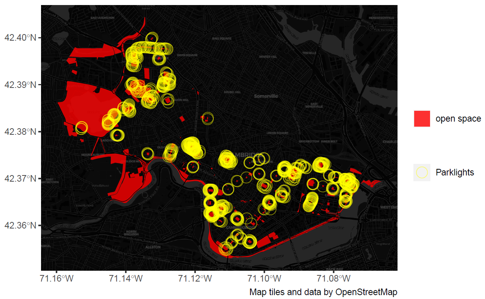](https://github.com/WTHSYZW/Portfolio/fullsize/bos2.pdf){target="_blank"}


# Maps of Manhattan
Here are three maps of Manhattan, New York. These maps demonstrate the following skills:
* Displaying multiple vector layers on the same map.
* Georeferencing a raster image

## Map of Manhattan’s coastline:
This map overlies the boundary of contemporary Manhattan on a historic map of Manhattan in 1853, revealing a
history of landfilling, dredging, adding piers, and otherwise altering the borough’s coastline.

[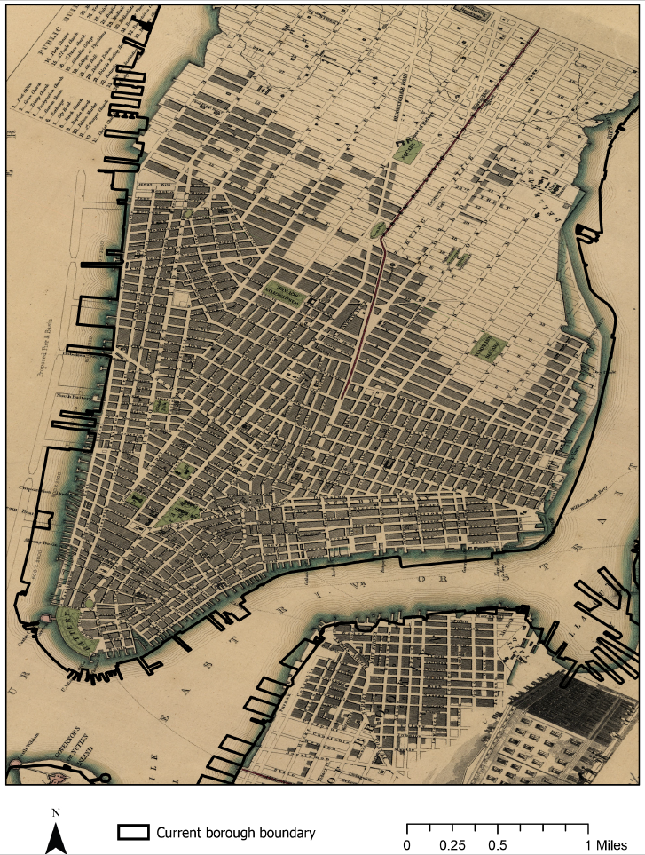](https://github.com/WTHSYZW/Portfolio/fullsize/ny1.pdf){target="_blank"}

## Map of Manhattan’s parks and open spaces:
By also adding the public parks and open space in Manhattan and
Brooklyn, we see both continuity and change. Washington Square and Tompkins Parks remain, while
new public spaces like East River and Brooklyn Bridge Parks have been designed in accordance with
explicit resilience goals.

[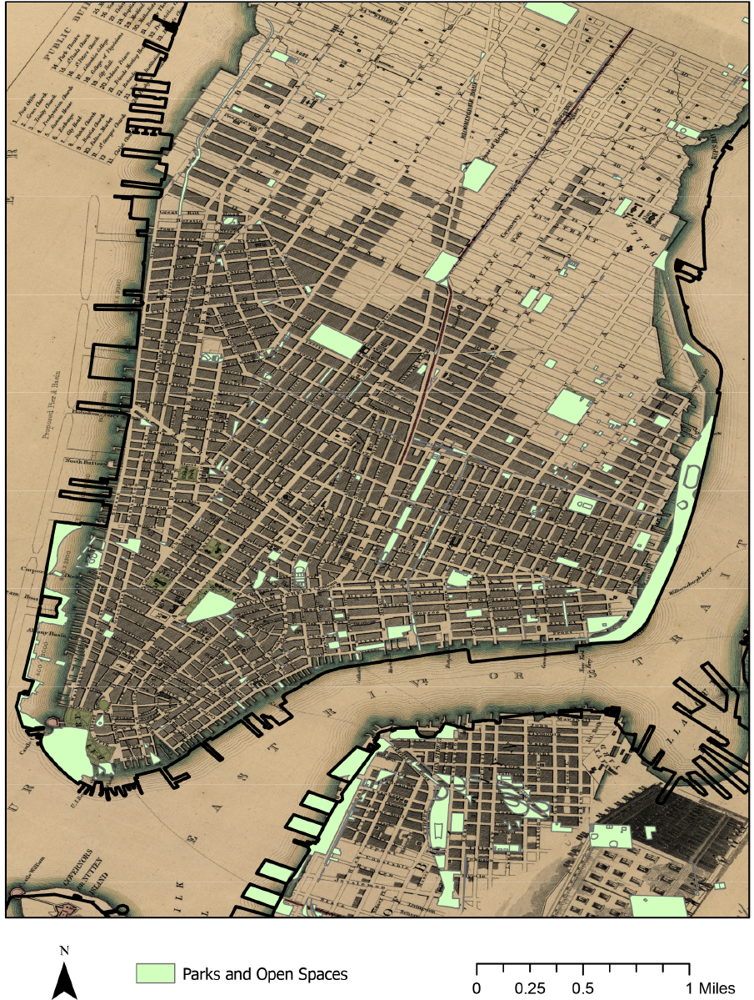](https://github.com/WTHSYZW/Portfolio/fullsize/ny2.pdf){target="_blank"}

## Map of Manhattan’s landmarks and subway line:
Beginning from the southern tip, which was first settled, and moving uptown - influenced the development of the subway system: The southern points enjoy intense subway coverage, while parts of the East Village and Gramercy are still distant from subway stations today. It’s also reflected in the concentration of sites listed by the Landmarks Preservation Council (LPC) in Lower Manhattan.

[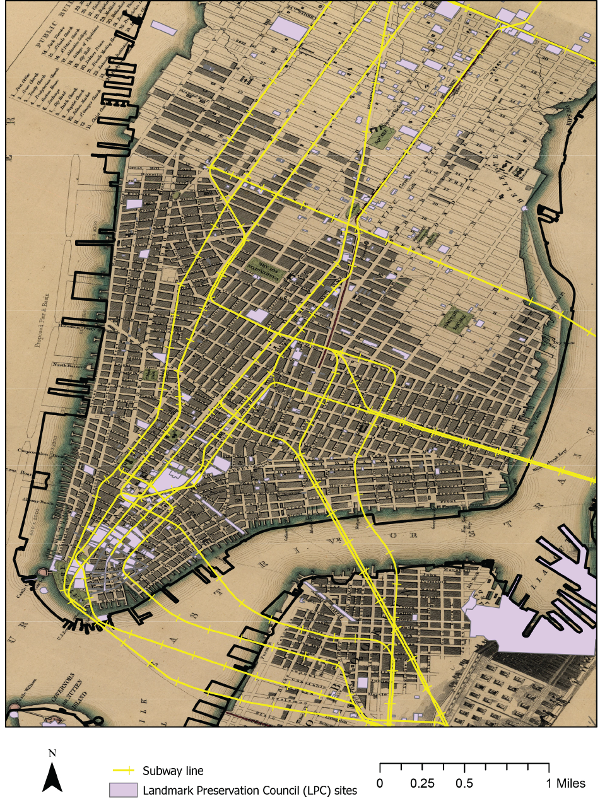]https://github.com/WTHSYZW/Portfolio/fullsize/ny3.pdf){target="_blank"}


# Maps of Jiaxing
Here are few maps of Jiaxing, China. These maps demonstrate the following skills:
* Displaying multiple vector layers on the same map
* Calculating and displaying relationships among point and polygon layers based on distance
* Aggregating point data to a layer of polygons
* Calculating and displaying accessibility, based on travel time
* Converting between raster layers and vector layers
* Displaying raster data on a map
* Displaying data on an interactive map

## Map of greenspaces in Jiaxing:
This map identifies the townships that contain at least one green space in Jiaxing. 


[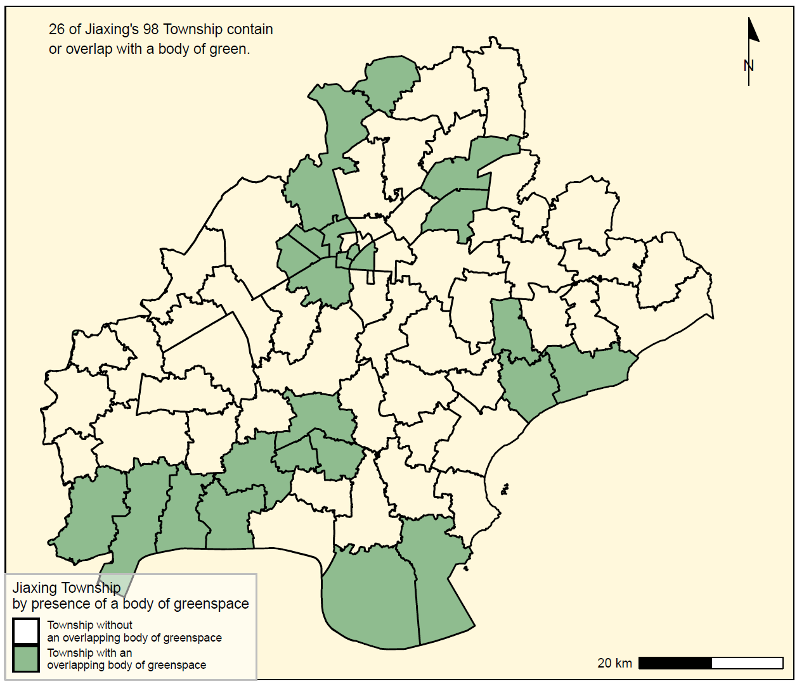](https://github.com/WTHSYZW/Portfolio/fullsize/weibo3.pdf){target="_blank"}

## Map of Weibo social data in Jiaxing:
This map visualizes the average density of Weibo posts per sq km in each township in relation to each other using a chloropleth map, allowing the reader to contextualize the volumes of posts.

[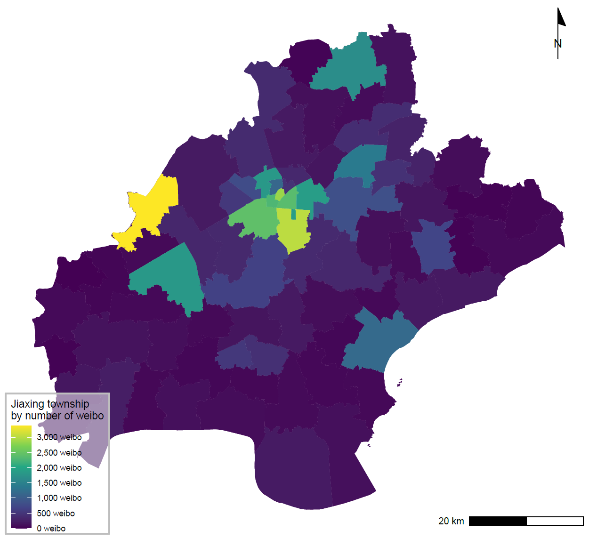](https://github.com/WTHSYZW/Portfolio/fullsize/weibo2.pdf){target="_blank"}

## Map of Weibo social data and greenspaces in Jiaxing:
This map examines the number of Weibo posts within a greenspace, allowing readers to visualize the relationship between greenspaces and weibo comments in Jiaxing. The result is only 5.5% of the posts occur within a greenspace.

[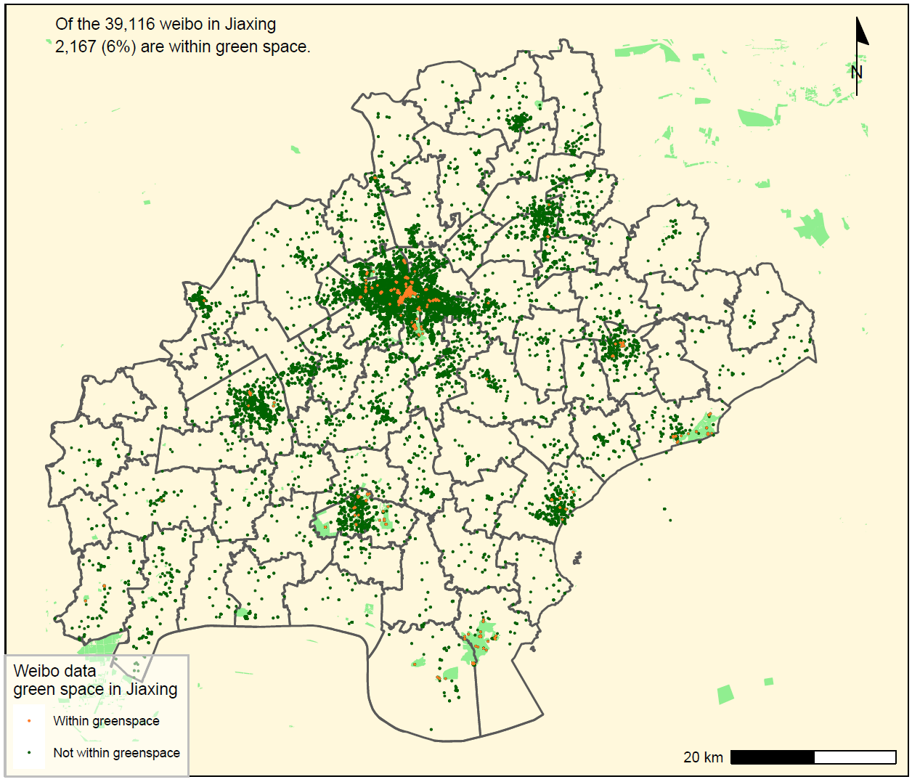](https://github.com/WTHSYZW/Portfolio/fullsize/weibo1.pdf){target="_blank"}

## Isochrones map of Walk travel time to nearest green space in Jiaxing:
Accessibility to greenspace is considered as one fundemental factor of residential happiness, which benefits individual's mental and physichal health. This map illustrates the location of green space within Jiaxing city, and the overall walk travel time to greenspace in the city.

[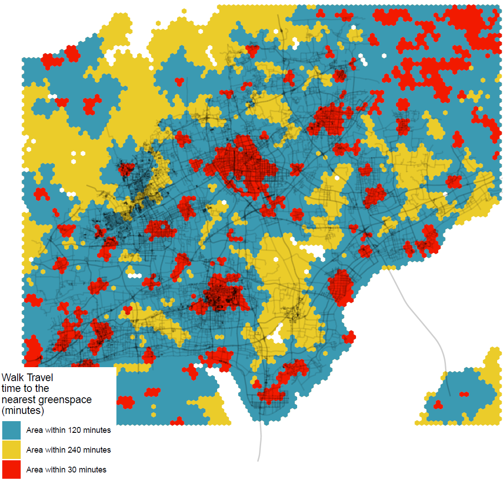](https://github.com/WTHSYZW/Portfolio/fullsize/jx1.pdf){target="_blank"}

## Accessibility Map of green space in Jiaxing:
Different from the isochrones map regarding nearest green space, this map depicts the scores of walking accessibility to green space in Jiaxing. As indicated, the urban space with the greatest accessibility to green space is found in the center of the city, where the network density is quite high. It's interesting to note that the dense network area on the upper left has a limited amount of green space.

[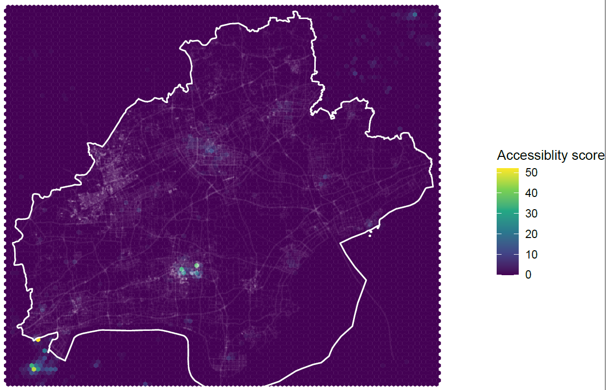](https://github.com/WTHSYZW/Portfolio/fullsize/jx2.pdf){target="_blank"}

## Contour Map of green space in Jiaxing:
This map stratifies the level of walking accessibility to green space in Jiaxing. The number and area of greenspaces in Jiaxing are limited, as illustrated, and there is a lot of void outside the contours, indicating insufficient access to greenspaces for urban residents

[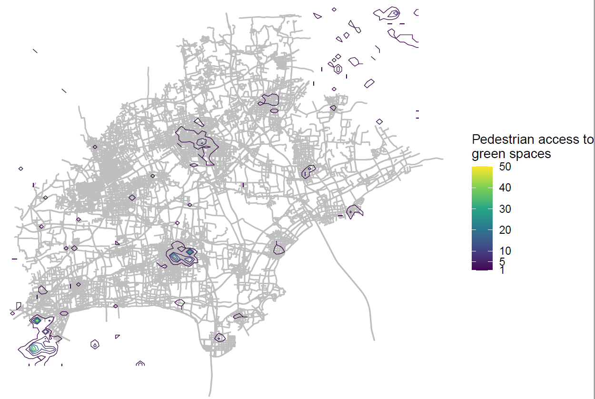](https://github.com/WTHSYZW/Portfolio/fullsize/jx3.pdf){target="_blank"}

## Interactive Map of busstops in Jiaxing:
This map attempts to demonstrate the number of bus stops owned per capita in each township. As is shown, the central area occupies the majority of bus stops and public transit.

[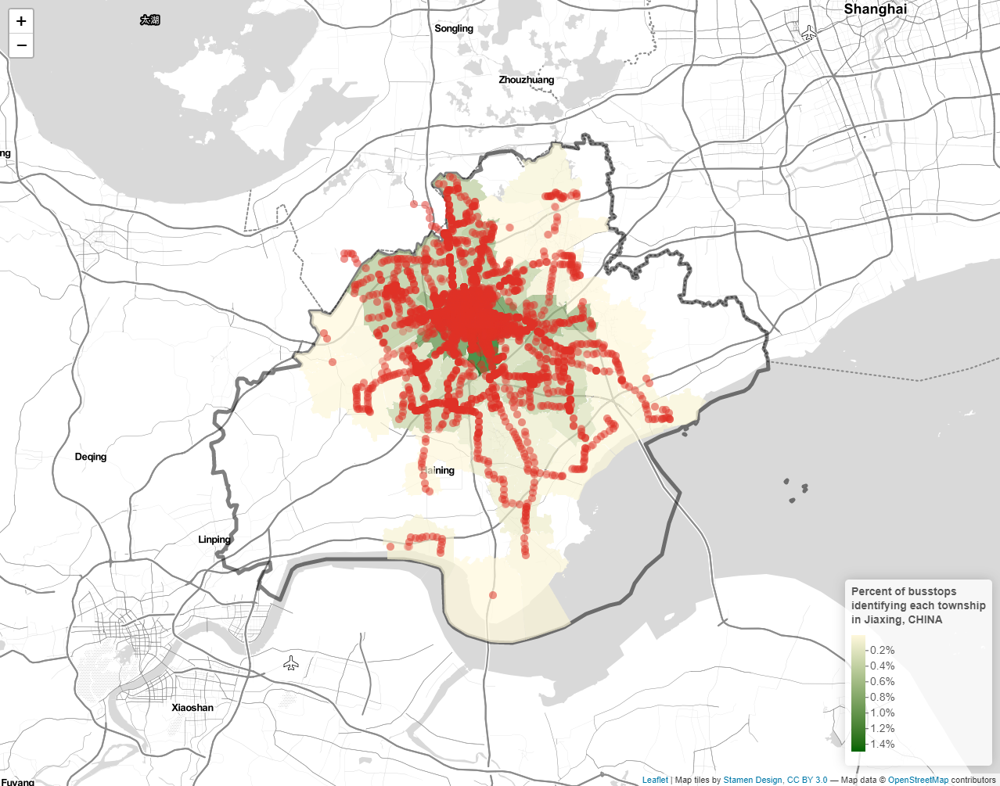](https://github.com/WTHSYZW/Portfolio/fullsize/JX_map2/html){target="_blank"}


